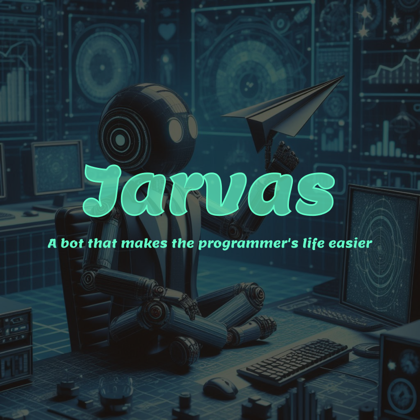
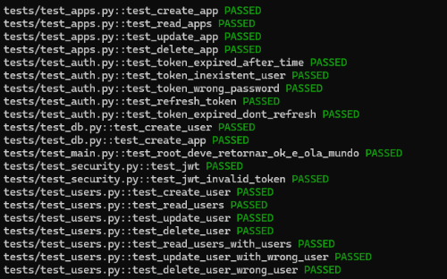
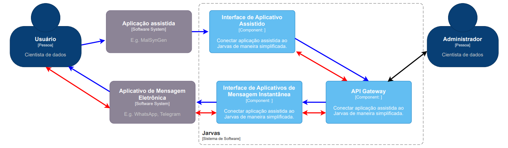

<h2>Bem-vindo ao projeto Jarvas!👋</h2>
<p>
Esta é API do Jarvas, básicamente ela é parte chave do projeto, se você não sabe o que é o jarvas, ele é Uma aplicação chatbot que facilita a vida do programador, auxiliando no desenvolvimento de programas, notificando o desenvolvedor e armazenando, tratando e explicando informações conforme a necessidade do usuário.
</p>
<hr/>


<h2>Modo de uso</h2>
<p>
Esta é uma aplicação em python, que usa diversas bibliotecas, como FastAPI para criação de rotas, Poetry para criação do ambiente virtual, Pytest para os testes da aplicação entre outras tecnologias!
</p>

<p>Iniciaremos então instalando o Poetry</p>

 ```
pip install poetry
 ```
<p>Inicie o ambiente virtual com: </p>

 ```
poetry shell
 ```
<p>Podemos agora instalar as bibliotecas do projeto! </p>
 
 ```
poetry install
 ```

<p>Para certificar se a aplicação está rodando da forma certa execute: </p>

 ```
task test
 ```

<p>Você deve ver algo parecido com: </p>

<p>Para iniciar a aplicação use: </p>

 ```
task run
 ```

<hr>
<h2>Próximos Passos: </h2>
<p>Agora que você tem API instalada pode utilizar para lhe auxiliar a testar suas Aplicações a biblioteca do Jarvas!</p>
<a href="https://github.com/RafaelNogueiraXD/jarvas-Library">Biblioteca Jarvas</a>
<p>Este é um diagrama c4-model para que você entenda todos os passos do Projeto Jarvas: </p>


