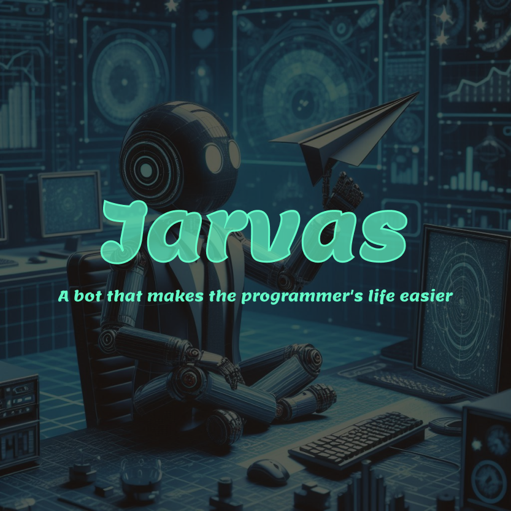
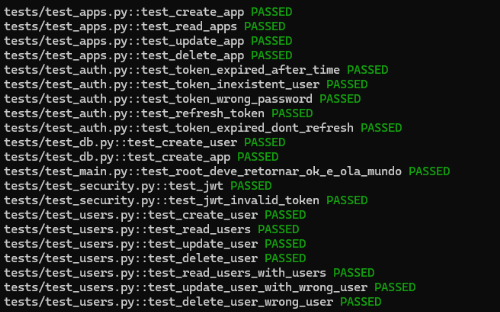
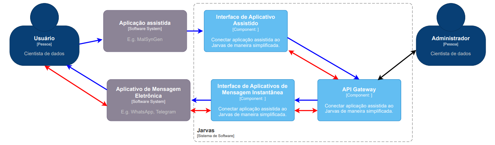

<h2>Welcome to the Jarvas Project! 👋</h2>
<p>
This is the Jarvas API, a key component of the project. If you are not familiar with Jarvas, it is a chatbot application that simplifies a developer's life by assisting in program development, notifying the developer, and storing, processing, and explaining information based on user needs.
</p>
<hr/>


<h2>How to Use</h2>
<p>
This is a Python application that leverages various libraries, including FastAPI for route creation, Poetry for virtual environment management, and Pytest for application testing, among others.
</p>

<p>Let’s begin by installing Poetry:</p>

 ```
pip install poetry
 ```

<p>Start the virtual environment with:</p>

 ```
poetry shell
 ```
<p>Now, we can install the project dependencies:</p>
 
 ```
poetry install
 ```

<p>To verify that the application is working correctly, run:</p>

 ```
task test
 ```

<p>You should see something similar to:</p>


<p>To start the application, use:</p>

 ```
task run
 ```

<hr>
<h2>Next Steps:</h2>
<p>Now that you have the API installed, you can use the Jarvas library to assist you in testing your applications!</p>
<a href="https://github.com/RafaelNogueiraXD/jarvas-Library">Jarvas Library</a>

<p>This is a C4 model diagram to help you understand all the steps of the Jarvas Project:</p>

